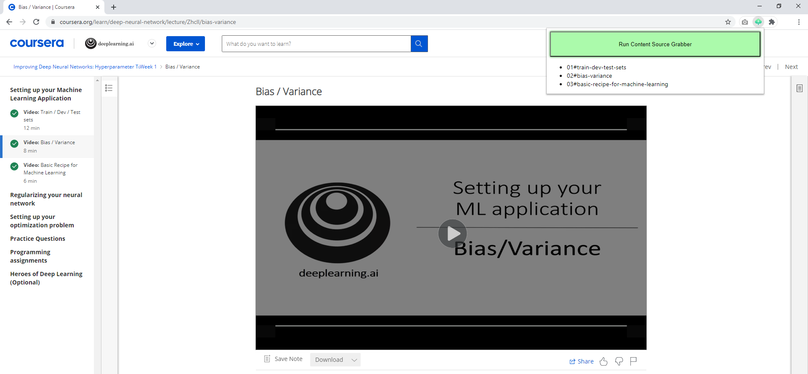
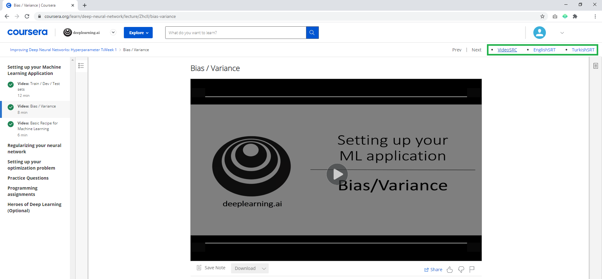
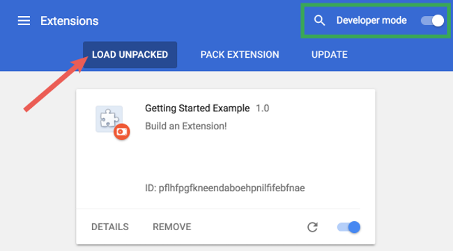

# Coursera Content Source Grabber [JVS]

**Versiyon	:**  1.0 		 
**Lisans  	:**  GPL 		 
**Contributors  :**  Burak Büyükyüksel	 

## What is this?
It realizes the grabbing of the source links of the contents in the course.

## Makes it easy;

*	<i> Allows viewing of course contents sequentially. </i>
*	<i> Grabs content links, bringing them in front of you as a dom element. </i>

<table>
	<tr>
		<th colspan=3> <b> Application Screenshots </b> </th>	
	</tr>
	<tr>
		<td> </td>
		<td> </td>
	</tr>
</table>

## Setup
<i>Reference <a href="https://developer.chrome.com/docs/extensions/mv2/getstarted/">Google: Get Started</a></i>

* Open the Extension Management page by navigating to chrome://extensions.
* The Extension Management page can also be opened by clicking on the Chrome menu, hovering over More Tools then selecting Extensions.
* Enable Developer Mode by clicking the toggle switch next to Developer mode.
* Click the LOAD UNPACKED button and select the extension directory.
